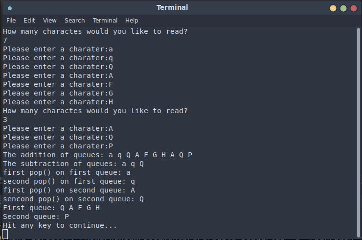

# Proiect pentru laborator
## The following code corespond to the below screen shot:
```
Coada_de_caractere coada;
Coada_de_caractere coada2;

std::cin>>coada>>coada2;


Coada_de_caractere coada3 = coada + coada2;
Coada_de_caractere coada4 = coada - coada2;
std::cout<<"The addition of queues: "<<coada3<<std::endl;
std::cout<<"The subtraction of queues: "<<coada4<<std::endl;


// eliminam cate 2 elemente din coada
std::cout<<"first pop() on first queue: "<<coada.pop()<<std::endl;
std::cout<<"second pop() on first queue: "<<coada.pop()<<std::endl;
std::cout<<"first pop() on second queue: "<<coada2.pop()<<std::endl;
std::cout<<"sencond pop() on second queue: "<<coada2.pop()<<std::endl;

std::cout<<"First queue: ";
std::cout<<coada<<std::endl;
std::cout<<"Second queue: ";
std::cout<<coada2<<std::endl;

```

